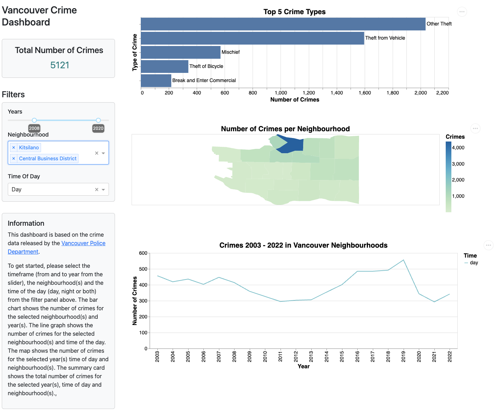

[Live Application](https://vancrime.onrender.com)

# Vancouver crime data (2003-2022)

Thank you for visiting the vancrime dashboard project repository. This repository hosts the dashboard for the Vancouver (Canada) crime data released by the Vancouver Police Department ([VPD](https://vpd.ca/)). This information, which spans 2003 through 2022, is public domain and is licensed under [CC0](https://creativecommons.org/publicdomain/zero/1.0/).

This README file serves as a central location for the project's documentation. You may either go directly to a subsection of interest or continue reading to learn more.

## Introduction
This is a dashboard application that helps users and interested parties visualize Vancouver crime data, publicly released by the Vancouver Police Department ([VPD](https://vpd.ca/)). The information will be arranged in a manner that takes into account the different types of criminal behavior, as well as the time periods and neighbourhoods involved. It is important to note that the purpose of this dashboard is not to label any specific area of Vancouver with a negative connotation, but rather to educate. For a detailed description of the motivation, description, and usage scenarios, please visit [Proposal](proposal.md).

## How to use this app

The program follows a conventional dashboard layout in which the user can select or specify the scope of what they need to visualize on the left side, and a set of relevant visualization components that update in response to the user's selection criteria on the right.

Here's a link to the live [application](https://vancrime.onrender.com) if you like to check it out.

This dashboard application includes the following selection/filtering mechanisms:

1. Specify the range of years, in the form of a slider that allows the user to select the from and to year range
2. Specify one or more Vancouver neighbourhood to focus the visulization on
3. Specify the time of day: day, night or both 

This dashboard has the following visualizations:

1. A summary of the total number of crimes based on the selected filters
2. A bar plot of the top 5 crimes for the selected range of years (2003 to 2022), chosen Vancouver neighbourhoods and time of day (night, day or both). 
3. A low-resoution heat map of Vancouver neighbourhoods with total crimes count, for the selected range of years. Additionally, the map shows the number of crimes as a tooltip when the user hovers over different neighbourhoods of the city of Vancouver.
4. The final graph is a time series that illustrates the crimes that happened between 2003 and 2022. Moreover, the user can choose to segregate the crimes by the time of the day when the incident occurred (day, night or both) and inspect trends

## How to get involved and contribute

## Getting started

## License

## Credits

## Quick Links
